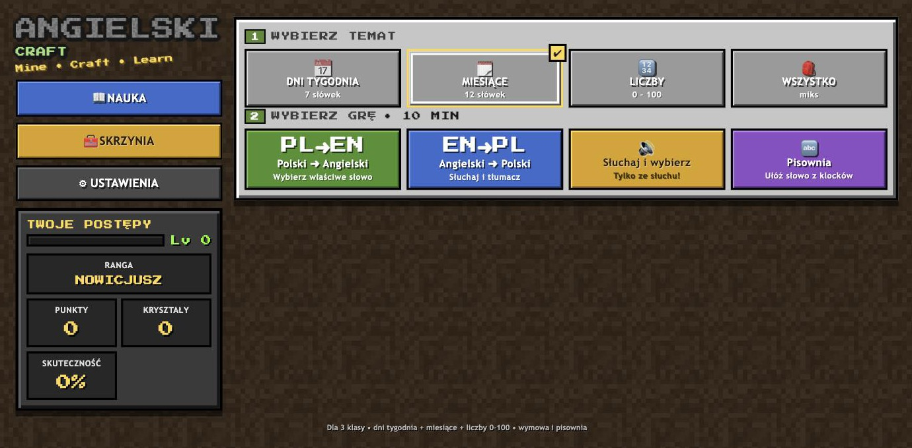
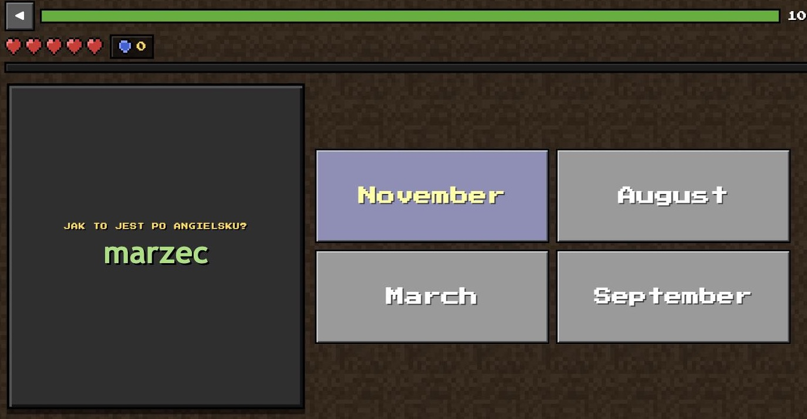
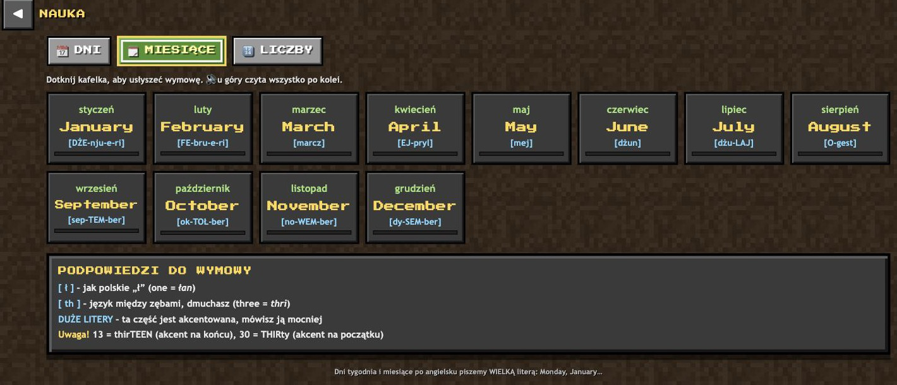

# ⛏ Angielski Craft

Gra do nauki angielskiego dla dzieci z wczesnych klas podstawówki — **dni tygodnia, miesiące i liczby 0–100**. Słownictwo, wymowa i pisownia, w oprawie inspirowanej Minecraftem.

Jeden plik HTML. Zero zależności, zero buildu, zero konta. Działa offline i pamięta postępy.

### ▶ [Zagraj teraz](https://marcinmatras.github.io/en-craft/)

[](LICENSE)




---

## Co jest do nauki

| Temat | Zakres |
|---|---|
| 📅 Dni tygodnia | 7 słówek, `Monday` … `Sunday` |
| 🗓 Miesiące | 12 słówek, `January` … `December` |
| 🔢 Liczby | 0–100, z wyborem zakresu: 0–10, 0–20, 0–50, 0–100 |
| 🎒 Wszystko | miks wszystkich trzech |

## Tryby gry

| Tryb | Na czym polega |
|---|---|
| **PL ➜ EN** | Widzisz polskie słowo, wybierasz angielskie |
| **EN ➜ PL** | Słyszysz i widzisz angielskie, wybierasz polskie |
| **Słuchaj i wybierz** | Tylko ze słuchu — bez tekstu na ekranie |
| **Pisownia** | Układasz słowo z klocków z literami albo wpisujesz z klawiatury |
| **Wpisz cyframi** | Słyszysz liczbę, wystukujesz ją na klawiaturze numerycznej |



## Wymowa

Czytanie na głos idzie przez **Web Speech API** przeglądarki — do wyboru akcent 🇬🇧 brytyjski lub 🇺🇸 amerykański i trzy tempa mowy (wolno / normalnie / szybko).

Do tego każde słowo ma **zapis wymowy w polskiej transkrypcji**, żeby dziecko mogło przeczytać je samo, bez znajomości IPA:

> `September` → `[sep-TEM-ber]` &nbsp;·&nbsp; `three` → `[thri]` &nbsp;·&nbsp; `one` → `[łan]`

DUŻE LITERY oznaczają sylabę akcentowaną — co od razu rozbraja klasyczną pułapkę `thirTEEN` vs `THIRty`.



## Żeby chciało się grać

- ❤️ **Serca** — pięć żyć, +1 co dziesięć poprawnych odpowiedzi pod rząd
- 💎 **Kryształy** — lapis, redstone, złoto, szmaragd, diament, netheryt; im dłuższa seria, tym lepszy łup
- ⚡ **XP i poziomy**, ranga od `NOWICJUSZA` do `LEGENDY NETHERU`
- 🏆 **Odznaki** za serie, skuteczność i wytrwałość
- ⏱ **Gra na czas** (5 / 10 / 15 min) albo tryb treningowy na 20 pytań

Pytania nie lecą losowo — słowa, na których dziecko się myli, **wracają częściej**, a te dobrze opanowane rzadziej.

## Uruchomienie lokalne

```bash
git clone git@github.com:marcinmatras/en-craft.git
cd en-craft
open index.html          # i tyle
```

Serwer nie jest potrzebny — `index.html` otwiera się prosto z dysku. Jeśli wolisz przez HTTP:

```bash
python3 -m http.server 8000   # → http://localhost:8000
```

## Na tablecie

Najwygodniej dodać stronę do ekranu głównego (Safari: *Udostępnij ➜ Do ekranu początkowego*). Gra odpali się wtedy na pełnym ekranie, bez pasków przeglądarki, i będzie działać bez internetu.

## Jak to jest zrobione

- **Jeden plik `index.html`** — HTML, CSS i JavaScript razem, ~1950 linii. Żadnego npm, bundlera ani frameworka
- **Tekstury generowane w locie** na `<canvas>` 16×16 px — kamień, ziemia, trawa, kryształy. Dlatego repo nie ma ani jednego pliku graficznego poza zrzutami do README
- **Dźwięki z Web Audio API** — syntezowane, nie sample
- **`localStorage`** trzyma postępy, statystyki per słówko, odznaki i ustawienia. Nic nie wychodzi na zewnątrz, nie ma backendu ani analityki
- **Responsywny layout** — osobny układ dwukolumnowy dla tabletu w poziomie, skalowanie czcionek pod długość słowa

## Licencja

[MIT](LICENSE) — rób z tym co chcesz, zostaw tylko notę o autorstwie.
